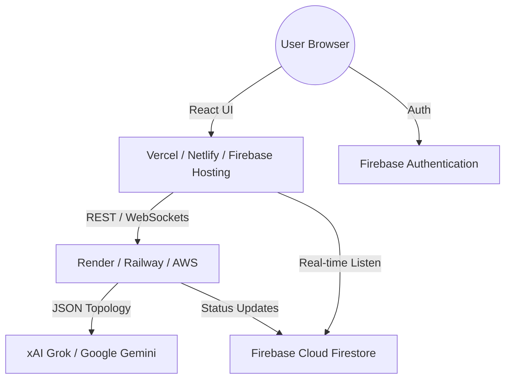

# Maptive Hosting & Architecture Guide

This document outlines the steps to host the Maptive project (Frontend & Backend) and describes the system architecture.

---

## 1. System Architecture

Maptive is a full-stack application with a "Digital Twin" approach to network monitoring.

### High-Level Flow
1. **Frontend (React)**: Hosted on a Static Hosting provider. Communicates with Firebase for Auth/Data and the FastAPI Backend for AI/Logic.
2. **Backend (FastAPI)**: Hosted on a Cloud Platform. Handles WebSocket telemetry, AI topology generation, and file parsing.
3. **Database (Firebase)**: Provides real-time event synchronization (telemetry logs) between the dashboard and any external sensors.
4. **AI Layer**: Integration with Grok (xAI) or Gemini (Google) for PDF-to-Topology conversion.

### Architecture Diagram (Visual Representation)

---

## 2. Hosting Steps

### A. Frontend Deployment (React)
Recommended: **Vercel** or **Firebase Hosting**

1. **Environment Variables**:
   In your hosting provider's dashboard, add all variables from `frontend/.env`:
   - `VITE_FIREBASE_API_KEY`
   - `VITE_FIREBASE_AUTH_DOMAIN`
   - ...etc.
   - **IMPORTANT**: Add `VITE_BACKEND_URL` pointing to your hosted FastAPI server.

2. **Build & Deploy**:
   - Build Command: `npm run build`
   - Output Directory: `dist`
   - Install Command: `npm install`

---

### B. Backend Deployment (Python/FastAPI)
Recommended: **Render**, **Railway**, or **Fly.io**

1. **Preparation**:
   Ensure `backend/requirements.txt` is up to date.

2. **Deploy via Git**:
   Connect your GitHub repository to the provider.

3. **Configuration**:
   - **Start Command**: `uvicorn main:app --host 0.0.0.0 --port $PORT`
   - **Python Version**: 3.9+
   - **Environment Variables**: Add any keys required (e.g., `SECRET_KEY`).

---

### C. Firebase Configuration
1. Go to the [Firebase Console](https://console.firebase.google.com/).
2. Enable **Authentication** (Google Login).
3. Create a **Firestore Database** in test mode (or production with rules).
4. Update the **Authorized Domains** in your Firebase Authentication settings to include your hosted frontend URL (e.g., `maptive.vercel.app`).

---

## 3. Deployment Checklist

- [ ] Firebase Config updated in Frontend Environment.
- [ ] CORS allowed for Frontend URL in `backend/graph_engine.py`.
- [ ] AI API keys (xAI/Gemini) configured.
- [ ] Backend WebSocket URL updated in Frontend.

---

Generated by Maptive AI Architect.
